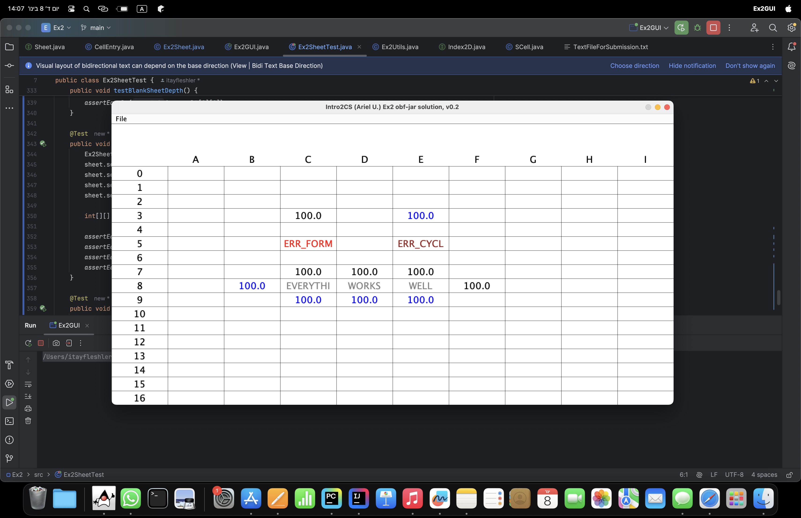

# Spreadsheet Project

### Ex2 - Foundation of Object-Oriented and Recursion

## Introduction
This assignment focuses on designing and implementing a basic version of a spreadsheet. The spreadsheet is a 2D array of cells, each of which can be a string (text), a number (double), or a formula. The main goal here is to understand and implement the foundation of object-oriented design and recursion.



## Assignment Overview
### Valid Formulas:
- `=number` (e.g., `=1`, `=1.2`)
- `=(Formula)` (e.g., `=(0.2)`)
- `=Formula op Formula` (op is one of {`+`, `-`, `*`, `/`} e.g., `=1+2`, `=1+2*3`, `=(1+2)*((3))-1`)
- `=cell` (e.g., `=A1`, `=A2+3`, `=(2+A3)/A2`)

### Invalid Formulas:
- `a`, `AB`, `@2`, `2+)`, `(3+1*2)-`, `=()`, `=5**`

### Error Types:
- **ERR_WRONG_FORM**: Incorrect formula syntax
- **ERR_CYCLE**: Cyclic reference (e.g., `A0:A0`)

## Project Structure 

### Spreadsheet Class (`Ex2Sheet`)
The `Ex2Sheet` class represents the spreadsheet. It contains an array of `SCell` objects and provides methods to manipulate and evaluate these cells.

#### Key Methods:
- **Initialization**: Constructs the spreadsheet with specified dimensions and initializes cells.
- **Cell Management**: Provides methods to get and set cell values.
- **Evaluation**: Handles formula evaluation and ensures all cell dependencies are resolved correctly.
- **File I/O**: Supports saving the spreadsheet to a file and loading it back.

### Cell Class (`SCell`)
The `SCell` class represents an individual cell in the spreadsheet. It manages the data, type, and evaluation of the cell content.

#### Key Methods:
- **Data Storage**: Holds the raw data and evaluated value.
- **Type Management**: Determines if the cell contains text, numbers, or formulas.
- **Formula Handling**: Computes the result of formulas using basic arithmetic operations and handles cell references.

### Cell Entry Class (`CellEntry`)
The `CellEntry` class manages cell coordinates and provides conversion between spreadsheet notation (e.g., "A0") and array indices.

#### Key Methods:
- **Conversion**: Converts between spreadsheet notation and array indices.
- **Validation**: Ensures coordinates are within a valid range.

## Features
- **Text**: Cells can contain plain text.
- **Numbers**: Cells can contain numeric values.
- **Formulas**: Cells can contain formulas, which can include:
  - Numbers (e.g., `=1`, `=1.2`)
  - Arithmetic operations (e.g., `=1+2`, `=(1+2)*3`)
  - Cell references (e.g., `=A1`, `=A1+B2`)
  - Nested formulas (e.g., `=(A1+B2)*C3`)

## Design Solution Plan
### Step-by-Step Plan:
1. **Understand the Assignment**: Experience with a partial solution, understand the requirements and constraints.
2. **Project Setup**: Create a new Java project named `Ex2`, share it on GitHub.
3. **Design the Cell Class**:
   - Methods to check if the cell content is a number, text, or formula.
   - Method to compute the value of a formula.
4. **Design the Spreadsheet Class**:
   - Methods to get and set cell values.
   - Methods to evaluate the value of cells and handle dependencies.
   - Methods to save and load the spreadsheet from a file.
5. **Implement and Test**: Implement the designed classes and thoroughly test them using JUnit.

### Main Challenges:
- **Formula Evaluation**: Correctly parse and evaluate formulas, handle nested expressions, and manage operator precedence.
- **Dependency Resolution**: Ensure that cell dependencies are resolved correctly, detect and handle cycles (e.g., A1 referencing A1).
- **File I/O**: Implement robust methods to save and load the spreadsheet state to and from a file.

## Example Usage 
Here's a small example to demonstrate how to use the classes:

```java
public class Main {
    public static void main(String[] args) {
        // Create a new spreadsheet with default dimensions (26x100)
        Ex2Sheet sheet = new Ex2Sheet();

        // Set values in the spreadsheet
        sheet.set(0, 0, "5");      // A0 = 5
        sheet.set(0, 1, "10");     // A1 = 10
        sheet.set(0, 2, "=A0+A1"); // A2 = A0 + A1

        // Evaluate all cells
        sheet.eval();

        // Print the value of cell A2
        System.out.println(sheet.value(0, 2)); // Output: 15.0

        // Save the spreadsheet to a file
        try {
            sheet.save("spreadsheet.txt");
        } catch (IOException e) {
            e.printStackTrace();
        }

        // Load the spreadsheet from the file
        try {
            Ex2Sheet loadedSheet = new Ex2Sheet();
            loadedSheet.load("spreadsheet.txt");
            System.out.println(loadedSheet.value(0, 2)); // Output: 15.0
        } catch (IOException e) {
            e.printStackTrace();
        }
    }
}
```
## Key Components

### Formula Parsing and Evaluation

To handle formulas, the `SCell` class includes methods to parse and evaluate expressions. The process involves:

- **Tokenization**: Breaking down the formula string into individual components (numbers, operators, cell references).
- **Parsing**: Constructing an abstract syntax tree (AST) to represent the formula structure.
- **Evaluation**: Recursively evaluating the AST, resolving cell references, and performing arithmetic operations.

### Handling Cell Dependencies and Cycles

The `Ex2Sheet` class manages cell dependencies to ensure that formulas referencing other cells are evaluated correctly. This involves:

- **Dependency Tracking**: Keeping track of which cells depend on each other.
- **Depth Calculation**: Determining the evaluation order based on dependency depth.
- **Cycle Detection**: Identifying and handling cyclic references to prevent infinite loops.

### File I/O Operations

The `Ex2Sheet` class supports saving the spreadsheet state to a file and loading it back. This includes:

- **Serialization**: Converting the spreadsheet data into a string format suitable for file storage.
- **Deserialization**: Reading the file and reconstructing the spreadsheet state.

### Testing and Validation

Thorough testing is crucial to ensure the correctness of the spreadsheet implementation. This involves:

- **Unit Testing**: Writing JUnit tests for individual methods and classes.
- **Integration Testing**: Verifying that different components work together as expected.
- **Edge Cases**: Testing edge cases, such as invalid formulas, large numbers, and cyclic references.
